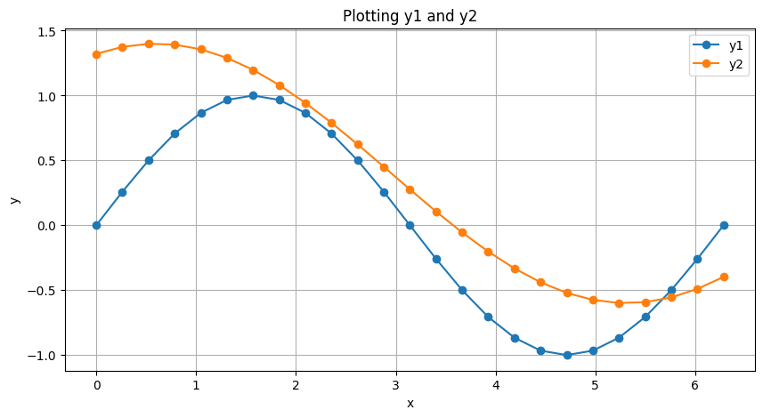
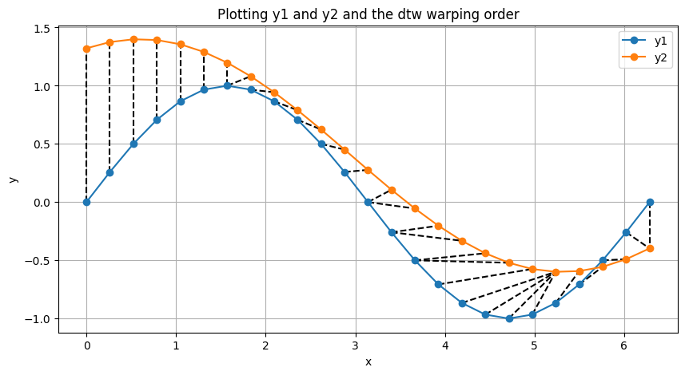
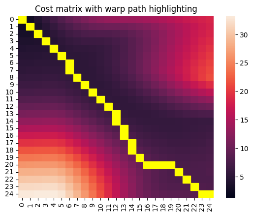

# Dynamic Time Warping

Implementing dynamic time warping in python.

## How to use

Clone the repository to a folder named `dtw`

```
$ git clone https://github.com/nikhilsrajan/dtw.git
```

Import into your python file and use the functions

```python
import dtw

...
```

## Example

```python
import numpy as np
import matplotlib.pyplot as plt
from matplotlib.patches import Rectangle
import seaborn as sns
import dtw


x = np.linspace(0,np.pi*2,25)
y1 = np.sin(x)
y2 = np.cos(x/1.5-0.4) + 0.4


# plot y1 and y2
fig, ax = plt.subplots(figsize=(10,5))
ax.plot(x, y1, 'o-', label='y1')
ax.plot(x, y2, 'o-', label='y2')
ax.grid()
ax.legend()
ax.set_xlabel('x')
ax.set_ylabel('y')
ax.set_title('Plotting y1 and y2')
```



```python
# compute dtw distance
dtw_distance = dtw.dtw(y1, y2) # = 2.342

# get cost_matrix (not needed, only for visualisation)
cost_matrix = dtw.compute_accumulated_cost_matrix(y1, y2)

# get warp_indexes (not needed, only for visualisation)
warp_indexes = dtw.trace_warp_indexes(cost_matrix)


# plotting y1 and y2 with warp_indexes
fig, ax = plt.subplots(figsize=(10,5))
for idx_1, idx_2 in warp_indexes:
    ax.plot([x[idx_1], x[idx_2]], [y1[idx_1], y2[idx_2]], 'k--')
ax.plot(x, y1, 'o-', label='y1')
ax.plot(x, y2, 'o-', label='y2')
ax.grid()
ax.legend()
ax.set_xlabel('x')
ax.set_ylabel('y')
ax.set_title('Plotting y1 and y2 and the dtw warping order')
```



```python
# plotting cost_matrix with warp path highlighting
g = sns.heatmap(cost_matrix)
_ = g.set_title('Cost matrix with warp path highlighting')
for idx_1, idx_2 in warp_indexes:
    g.add_patch(Rectangle((idx_1, idx_2), 1, 1, fill=True, color='yellow'))
```


